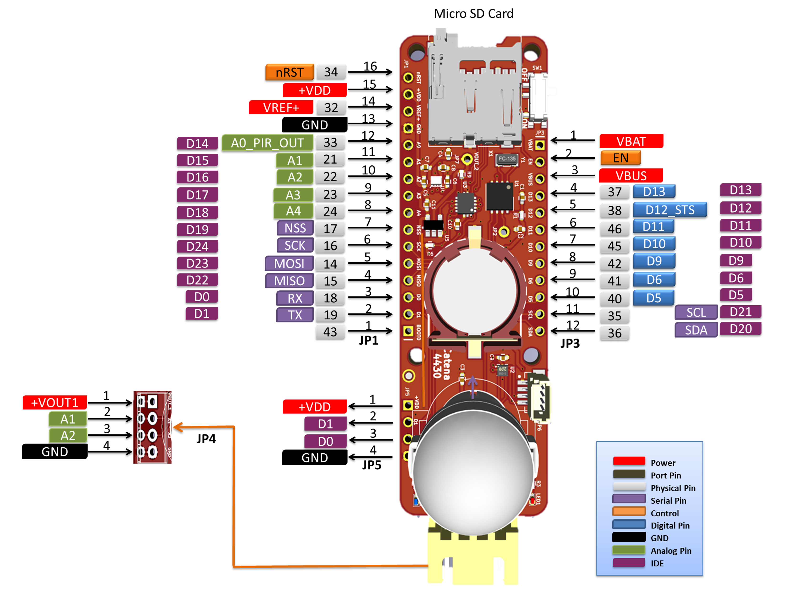

# MCCI Catena 4430 Hardware Information

This directory contains hardware information about the [MCCI Catena 4430](https://mcci.io/catena4430).

 

## MCCI Documentation

The following files are provided in this directory.

- [Schematics](./234001199b_(Catena-4430-Schematic).pdf)
- [PCB Fabrication Drawing](./234001201a_(Catena-4430-Shield-PCB-Layout-Fabrication-Drawing).pdf)
- [Pinout and functional diagram](Catena-4430-PinMapping.png)

For help, raise an issue here, or go to MCCI's [support portal](https://portal.mcci.com).

## Sensor and Third-Party Documentation

All links are to vendor sites.

- PIR Motion Sensor, Panasonic Electric Works EKMB1391112K: [PIR Motion Sensor.pdf](https://b2b-api.panasonic.eu/file_stream/pids/fileversion/4541)
- Memory Card Holder, GCT MEM2061-01-188-00-A: [Memory Card Holder.pdf](https://gct.co/files/drawings/mem2061.pdf)
- RTC CLK, NXP USA Inc PCF8523T: [RTC-PCF5823.pdf](https://www.nxp.com/docs/en/data-sheet/PCF8523.pdf)
