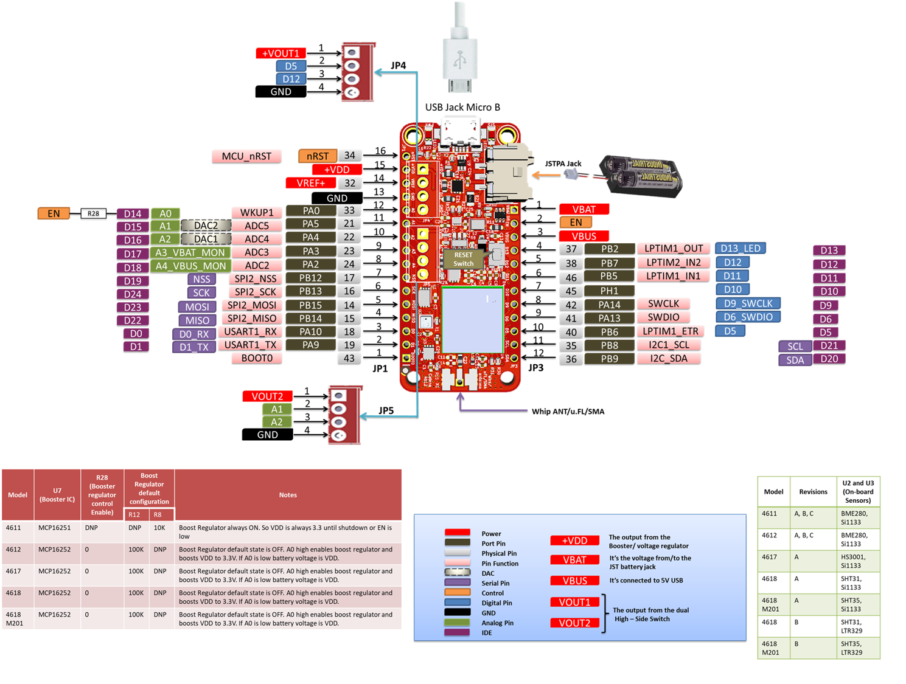

# MCCI Catena 4612 Hardware Information

This directory contains hardware information about the [MCCI Catena 4612](https://mcci.io/catena4612).

|            |             |
-------------|-------------
 | 

This information also applies to the Catena 4611. The Catena 4611 is identical to to 4612, but only operates with regulated 3.3V -- the EN pin switches VDD off and on, rather than switching from unregulated Vbat to regulated 3.3V. The 4611 is available by special order.

## MCCI Documentation

The following files are provided in this directory.

- [Schematics](./234001102c_(Catena-4611_4612-Schematic).pdf)
- [PCB Fabrication Drawing](./234001103a_(Catena-4611-PCB-Layout-Fabrication-Drawing).pdf)
- [User guide](./234001173a_(Catena-4612-User-Manual).pdf)
- [Pinout and functional diagram](Catena-4611_4612_4617_4618-Pinout.png)

For help, raise an issue here, or go to MCCI's [support portal](https://portal.mcci.com).

## Sensor and Third-Party Documentation

All links are to vendor sites.

- Temperature, pressure, and humidity sensor, Bosch BME280: [https://ae-bst.resource.bosch.com/media/_tech/media/datasheets/BST-BME280-DS002.pdf](https://ae-bst.resource.bosch.com/media/_tech/media/datasheets/BST-BME280-DS002.pdf)
- Light sensor, Silicon Labs Si1133: [Si1133.pdf](https://www.silabs.com/documents/public/data-sheets/Si1133.pdf)
- Fujitsu 8k x 8 FRAM: [MB85RC64TA-DS501-00044-3v0-E.pdf](https://www.fujitsu.com/global/documents/products/devices/semiconductor/fram/lineup/MB85RC64TA-DS501-00044-3v0-E.pdf)
- Murata module: [type_abz.pdf](https://wireless.murata.com/pub/RFM/data/type_abz.pdf)
- STM32L0 reference manual: [DM00108281.pdf](https://www.st.com/resource/en/reference_manual/DM00108281.pdf)
- STM32L082 details: [stm32l082kb.pdf](https://www.st.com/resource/en/datasheet/stm32l082kb.pdf)

