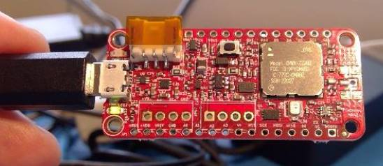

# MCCI Catena&reg; 4617

This directory contains hardware info for the MCCI Catena 4617.

**Contents:**

- [Introduction](#introduction)
- [Hardware Info](#hardware-info)
	- [Pinout diagram](#pinout-diagram)
	- [Schematics](#schematics)
	- [PCB Design Info](#pcb-design-info)
- [Meta](#meta)
	- [Copyright](#copyright)
	- [Trademark](#trademark)
	- [Thanks, Acknowledgments](#thanks,acknowledgments)

<!-- /TOC -->
<!-- markdownlint-restore -->

## Introduction

The Catena 4617 is a complete single-board IoT device for LoRaWAN technology projects. It combines CPU, radio and integrated sensors.

This designed is based on the Murata LoRa Module [CMWX1ZZABZ-078](https://wireless.murata.com/products/rf-modules-1/lpwa.html) and compatible with the [Adafruit Feather](https://www.adafruit.com/feather) family of development boards and accessories
 
 Here's the quick rundown:

- 8K bytes FRAM for LoRaWAN provisioning and frame counters.

- 1Mbyte SPI flash for bulk data storage, future FoTA firmware storage, etc.

- Powered from primary (disposable) batteries (such as 2x AAA cells).

- 2 sensors: HS3001 (humidity), SI1133 (light).

- Fully compatible with Adafruit Feather system.

- Ready for screw-terminals for field wiring; field wiring terminals include switchable 3.3V power (so you can turn off external sensors).

## Hardware Info

### Pinout diagram

### Schematics

Schematics are available [here](234001209a_(Catena-4617-Schematic).pdf).

### PCB Design Info

PCB Design info is available [here](234001211a_(Catena-4617-PCB-Layout-Fabrication-Drawing).pdf)

### User Manual

User manual is available [here](234001226a_(Catena-4617-User-Manual).pdf)

## Meta

### Copyright

Copyright 2019 MCCI Corporation. All rights reserved.

### Trademark

MCCI and MCCI Catena are registered trademarks of MCCI. LoRa is a registered trademark of Semtech Corporation. LoRaWAN is a registered trademark of the LoRa Alliance. All other trademarks are the properties of their respective owners.

### Thanks, Acknowledgments

Thanks to [Adafruit](https://www.adafruit.com/) for the wonderful Feather M0 LoRa platform, to [The Things Network](https://www.thethingsnetwork.org/) for the LoRaWAN-based infrastructure, to [The Things Network New York](https://thethings.nyc/) and [TTN Ithaca](https://ttni.tech/) for the inspiration and support, and to the myriad people who have contributed to the Arduino and LoRaWAN infrastructure.

