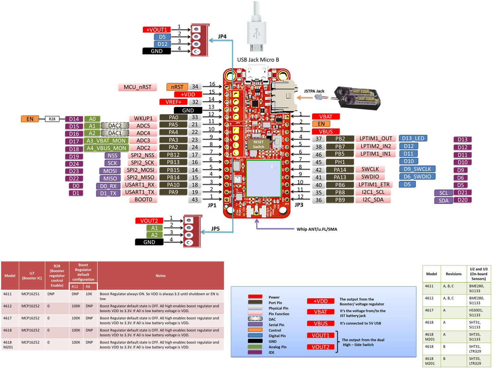

# MCCI Catena 4618 Hardware Information

This directory contains hardware information about the [MCCI Catena 4618](https://mcci.io/catena4618).

|            |             |
-------------|-------------
 | 

## MCCI Documentation

The following files are provided in this directory.

- [Schematics](./234001204a_(Catena-4618-Schematic).pdf)
- [PCB Fabrication Drawing](./234001206a_(Catena-4618-PCB-Layout-Fabrication-Drawing).pdf)
- [User guide](234001225a_(Catena-4618-User-Manual).pdf)
- [Pinout and functional diagram](Catena-4611_4612_4617_4618_4618-M201_Pinout.png)

For help, raise an issue here, or go to MCCI's [support portal](https://portal.mcci.com).

## Sensor and Third-Party Documentation

All links are to vendor sites.

- Temperature and humidity sensor, Sensirion SHT31-DIS-F: [Sensirion_Humidity_Sensors_SHT3x_Datasheet_digital.pdf](https://www.sensirion.com/fileadmin/user_upload/customers/sensirion/Dokumente/0_Datasheets/Humidity/Sensirion_Humidity_Sensors_SHT3x_Datasheet_digital.pdf)
- Light sensor, Silicon Labs Si1133: [Si1133.pdf](https://www.silabs.com/documents/public/data-sheets/Si1133.pdf)
- Fujitsu 8k x 8 FRAM: [MB85RC64TA-DS501-00044-3v0-E.pdf](https://www.fujitsu.com/global/documents/products/devices/semiconductor/fram/lineup/MB85RC64TA-DS501-00044-3v0-E.pdf)
- Murata module: [type_abz.pdf](https://wireless.murata.com/pub/RFM/data/type_abz.pdf)
- STM32L0 reference manual: [DM00108281.pdf](https://www.st.com/resource/en/reference_manual/DM00108281.pdf)
- STM32L082 details: [stm32l082kb.pdf](https://www.st.com/resource/en/datasheet/stm32l082kb.pdf)
