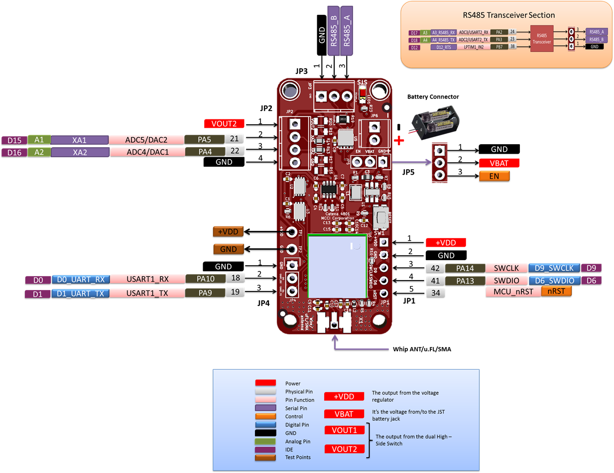

# MCCI Catena&reg; 4801 RS485 Node

This directory contains hardware info for the MCCI Catena 4801.

**Contents:**

- [Introduction](#introduction)
- [Hardware Info](#hardware-info)
	- [Pinout diagram](#pinout-diagram)
	- [Schematics](#schematics)
	- [PCB Design Info](#pcb-design-info)
- [Meta](#meta)
	- [Copyright](#copyright)
	- [Trademark](#trademark)
	- [Thanks, Acknowledgments](#thanks,acknowledgments)

<!-- /TOC -->
<!-- markdownlint-restore -->

## Introduction

The Catena 4801 RS-485 Node for LoRaWAN technology is a complete open source single-board IoT device that can monitor and control remote Modbus, M-Bus and other industrial devices.

Based on the Murata LoRa Module [CMWX1ZZABZ-078](https://wireless.murata.com/products/rf-modules-1/lpwa.html), the Catena 4801 is a great platform for RS485/Modbus based LoRaWAN investigation and deployment. It works well with [The Things Network](https://www.thethingsnetwork.org/), or any LoRaWAN 1.02 or 1.1 network in the 865 to 923 MHZ range.

This design compatible with the [Adafruit Feather](https://www.adafruit.com/feather) family of development boards and accessories
 
 Here's the quick rundown:

- RS485 transceiver for connecting to Modbus, M-bus, or other RS-485 networks.

- 8K bytes FRAM for LoRaWAN provisioning and frame counters.

- 1Mbyte SPI flash for bulk data storage, future FoTA firmware storage, etc.

- Switchable boost converter for powering from disposable batteries (such as 2x AAA cells) -- input range 1.8V to 3.3V. The Processor can disable boost converter when 3.3V is not required, for additional power savings.

- SWD for download and debug.

- Standby Current < 10uA.

- UART port for provisioning and logging.

- Fully compatible with Adafruit Feather system.

- Ready for screw-terminals for field wiring to the RS-485 network, and for connecting to additional external sensors or providing local control (pulse, analog or digital).

- Processor-controlled power switches for the RS-485 transceiver, the external sensors, FRAM and flash ICs, allowing very low standby current.

## Hardware Info

### Pinout diagram

### Schematics

Schematics are available [here](234001117b_(Catena-4801-Schematic).pdf).

### PCB Design Info

PCB Design info is available [here](234001115a_(Catena-4801-PCB-Layout-Fabrication-Drawing).pdf)

### User Manual

User manual is available [here](234001157a_(Catena-4801-User-Manual).pdf)

## Meta

### Copyright

Copyright 2018-2019 MCCI Corporation. All rights reserved.

### Trademark

MCCI and MCCI Catena are registered trademarks of MCCI. LoRa is a registered trademark of Semtech Corporation. LoRaWAN is a registered trademark of the LoRa Alliance. All other trademarks are the properties of their respective owners.

### Thanks, Acknowledgments

Thanks to [Adafruit](https://www.adafruit.com/) for the wonderful Feather M0 LoRa platform, to [The Things Network](https://www.thethingsnetwork.org/) for the LoRaWAN-based infrastructure, to [The Things Network New York](https://thethings.nyc/) and [TTN Ithaca](https://ttni.tech/) for the inspiration and support, and to the myriad people who have contributed to the Arduino and LoRaWAN infrastructure.

