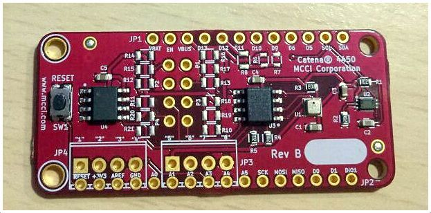
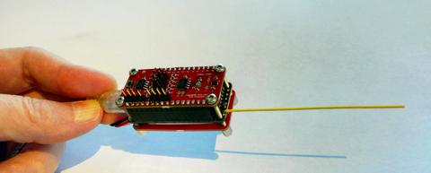
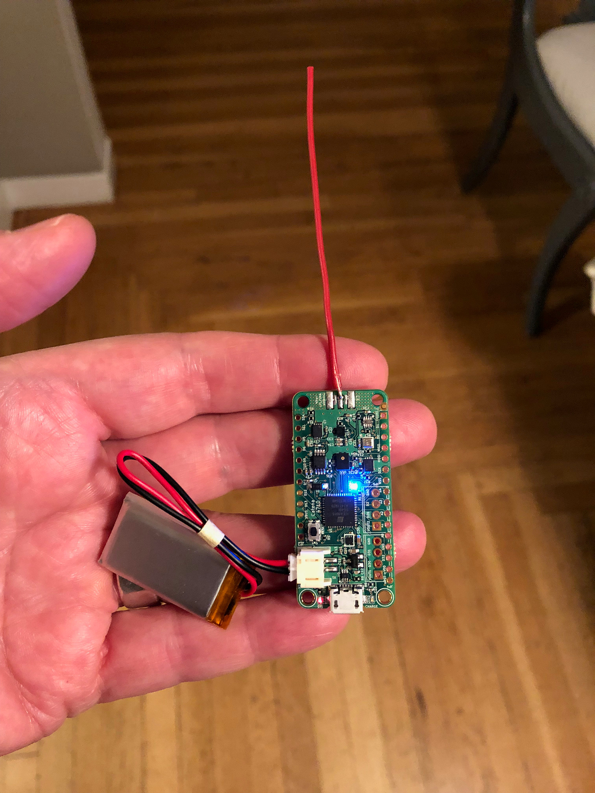
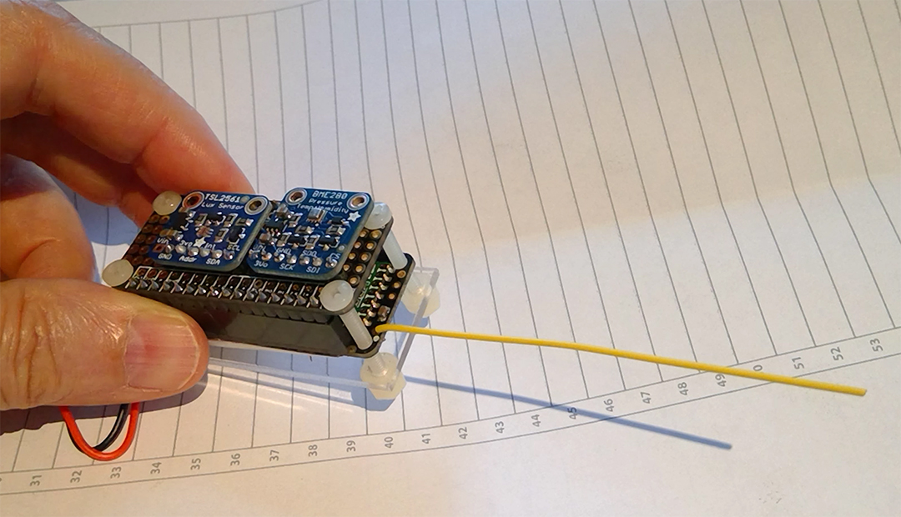

# HW-Designs

This repository contains hardware information about [MCCI](https://mcci.com)'s open-source hardware designs for Catena LoRaWAN projects.

Software can be found starting here: https://github.com/mcci-catena/Catena-Sketches.

<!--
  This TOC uses the VS Code markdown TOC extension AlanWalk.markdown-toc.
  We strongly recommend updating using VS Code, the markdown-toc extension and the
  bierner.markdown-preview-github-styles extension. Note that if you are using
  VS Code 1.29 and Markdown TOC 1.5.6, https://github.com/AlanWalk/markdown-toc/issues/65
  applies -- you must change your line-ending to some non-auto value in Settings>
  Text Editor>Files.  `\n` works for me.
-->
<!-- markdownlint-capture -->
<!-- markdownlint-disable -->
<!-- TOC depthFrom:1 updateOnSave:false -->

- [HW-Designs](#hw-designs)
	- [Hardware Documents](#hardware-documents)
		- [Feather Wings](#feather-wings)
		- [Stand-alone Boards](#stand-alone-boards)
		- [Other documents](#other-documents)
		- [Older boards and reference material](#older-boards-and-reference-material)
	- [Gallery](#gallery)
		- [Catena 4450](#catena-4450)
		- [Catena 4460](#catena-4460)
		- [Catena 4470](#catena-4470)
		- [Catena 4610](#catena-4610)
		- [Catena 4611/4612](#catena-46114612)
		- [Catena 4618](#catena-4618)
		- [Catena 4630](#catena-4630)
		- [Catena 4710](#catena-4710)
		- [Catena 4801](#catena-4801)
	- [Retired Boards](#retired-boards)
		- [Catena 4410](#catena-4410)
		- [Catena 4551](#catena-4551)
		- [Catena 4617](#catena-4617)

<!-- /TOC -->
<!-- markdownlint-restore -->
<!-- Due to a bug in Markdown TOC, the table is formatted incorrectly if tab indentation is set other than 4. Due to another bug, this comment must be *after* the TOC entry. -->

## Hardware Documents

All schematics are prepared with [KiCad](http://kicad-pcb.org/), an open-source hardware design package that is freely available.

### Feather Wings

Directory or file | Contents
------------------|---------
[Boards/Catena-4450/](Boards/Catena-4450/) | [Catena 4450 wing](#catena-4450) schematic and PCB layout Drawing. Also contains Catena 4450 DIY Kit Assembly instructions.
[Boards/Catena-4460/](Boards/Catena-4460/) | [Catena 4460 wing](#catena-4460) schematic and PCB layout Drawing.
[Boards/Catena-4470/](./Boards/Catena-4470/) | [Catena 4470 wing](#catena-4470) schematic and PCB layout Drawing.

### Stand-alone Boards

Directory or file | Contents
------------------|---------
[Boards/Catena-4610/](./Boards/Catena-4610/) | [Catena 4610](#catena-4610) schematic, Pinout Drawing and User manual.
[Boards/Catena-4611_4612/](./Boards/Catena-4611_4612/) | [Catena 4611/4612](#catena-46114612) schematic, Pinout Drawing, PCB Layout Drawing and User manual.
[Boards/Catena-4617/](./Boards/Catena-4617/) | [Catena 4617](#catena-4617) schematic, Pinout Drawing, PCB Layout Drawing and User manual.
[Boards/Catena-4618/](./Boards/Catena-4618/) | [Catena 4618](#catena-4618) schematic, Pinout Drawing, PCB Layout Drawing and User manual.
[Boards/Catena-4630/](./Boards/Catena-4630/) | [Catena 4630](#catena-4630) schematic and Model 4635 PMS7003 Adapter Board schematic.
[Boards/Catena-4710/](./Boards/Catena-4710) | [Catena 4710](#catena-4710) schematic, Pinout Drawing, PCB Layout Drawing, and overview.
[Boards/Catena-4801/](./Boards/Catena-4801/) | [Catena 4801](#catena-4801) schematic and manual.

### Other documents

Directory or file | Contents
------------------|---------
[Boards/lib/](./Boards/lib/) | the library of common shapes
doc/hualian-sensors.xlsx | the project planning document - BOMs, pricing, planning information.
doc/hualian-garden.mm | the FreeMind mind-map used for planning the project. Very useful for reference.
[Boards/pond-soil-proto/](./Boards/pond-soil-proto/) | the generic Catena 4410, used as a base design for the other sensor nodes. Integrated lux/temperature/pressure/humidity; external I2C, Dallas Semi OneWire, and specialized two-wire interface. In the end, all hardware was identical and based on this.

### Older boards and reference material

Directory or file | Contents
------------------|---------
[Boards/Catena-4410/Catena-4410-greenhouse/](./Boards/Catena-4410/Catena-4410-greenhouse/) | the greenhouse sensor: integrated lux/temperature/pressure/humidity, plus external soil temperature/humidity
[Boards/Catena-4410/Catena-4410-mushroom/](./Boards/Catena-4410/Catena-4410-mushroom/) | the mushroom-house sensor: integrated lux/temperature/pressure/humidity.
[Boards/Catena-4410/Catena-4410-seaweed/](./Boards/Catena-4410/Catena-4410-seaweed/) | the seaweed-house sensor: integrated lux/temperature/pressure/humidity, plus external water temperature.
[Boards/radio-feather-proto/](./Boards/radio-feather-proto/) | AKA the Catena 4420; this design combines an [Adafruit Feather M0 BTLE](https://www.adafruit.com/products/2995) with a separate [Feather RadioWing](https://www.adafruit.com/products/3231) to form a map-the-things node. Code is on branch MCCI-Catena [here](https://github.com/mcci-catena/mapthethings-arduino.git)
[Boards/Catena-4551/](./Boards/Catena-4551/) | [Catena 4551](#Catena 4551) schematic,PCB Layout Drawing, Pinout Drawing, DIY Kit assembly and other related documents.
[Boards/solar-panel-0w5-usb/](./Boards/solar-panel-0w5-usb/) | Solar panel design for charging the LiPo batteries.

## Gallery

### Catena 4450

### Catena 4460

### Catena 4470

### Catena 4610

### Catena 4611/4612

### Catena 4618

### Catena 4630

### Catena 4710

### Catena 4801

## Retired Boards

### Catena 4410

### Catena 4551

(Note: this board is not in production.)

### Catena 4617

(Note: this board is not in production.)
